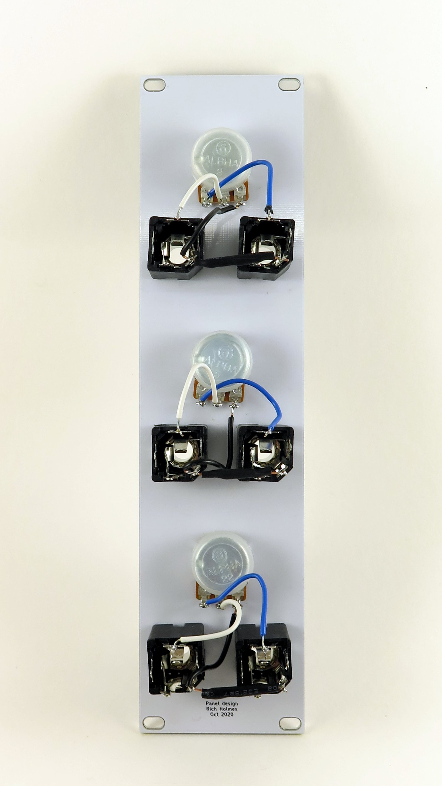

Front panel for an attenuator module

Build this without a PCB: Just install jacks and pots and wire them together. Connections are like those shown at http://musicfromouterspace.com/analogsynth_new/OCTATTENUATOR/OCTATTENUATOR.php (but only three sets instead of eight).

