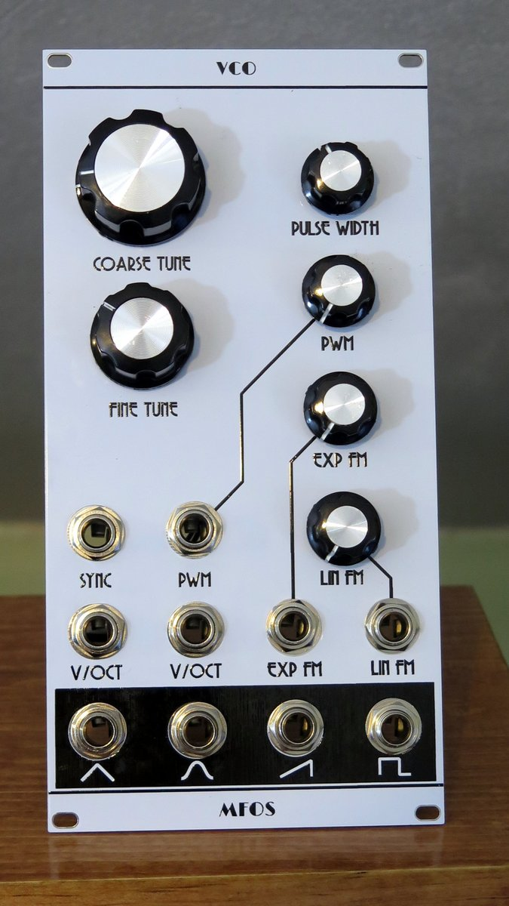

Kosmo format front panel for the Music From Outer Space VCO synth module.

Build the MFOS circuit board unmodified, mount using a bracket attached with pots. The panel adds attenuators for one V/Oct CV (renamed Exp FM) and the Lin FM and PWM CVs. Wire the tip of the CV input jack to pot pin 3, pot pin 1 to ground, pot pin 2 to the PCB where the jack would have been connected.

